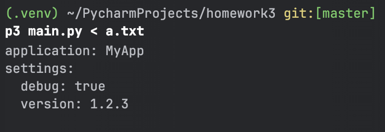
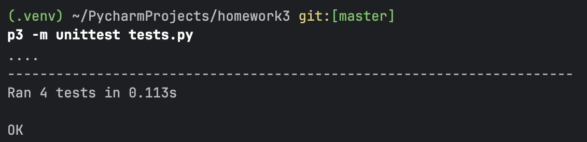

# Инструмент командной строки для учебного конфигурационного языка

## Описание
Этот инструмент преобразует текст из входного формата в выходной на языке yaml.

## Установка и запуск
1. Убедитесь, что у вас установлен Python 3.8 или выше.
2. Установите библиотеку pyyaml 
3. Установите зависимости Python:
   ```zsh
   pip install pyyaml
   ```
4. Скачайте проект или клонируйте репозиторий.
5. Создайте JSON-конфигурационный файл для настройки. Пример:
   ```
   app_name = "MyApp";
   version = "1.2.3";
   table([
     application = ?{app_name},
     settings = table([
     debug = true,
     version = ?{version}
     ])
   ])
   ```
6. Запустите проект:
   ```zsh
   python3 main.py < "имя входного файла"
   ```

### Пример
```zsh
python3 main.py < input.txt
```

## Тестирование
1. Для запуска тестов выполните:
   ```zsh
   python3 -m unittest tests.py
   ```
2. Убедитесь, что тестовые файлы находятся в рабочем каталоге.

## Скриншоты работы программы


---
